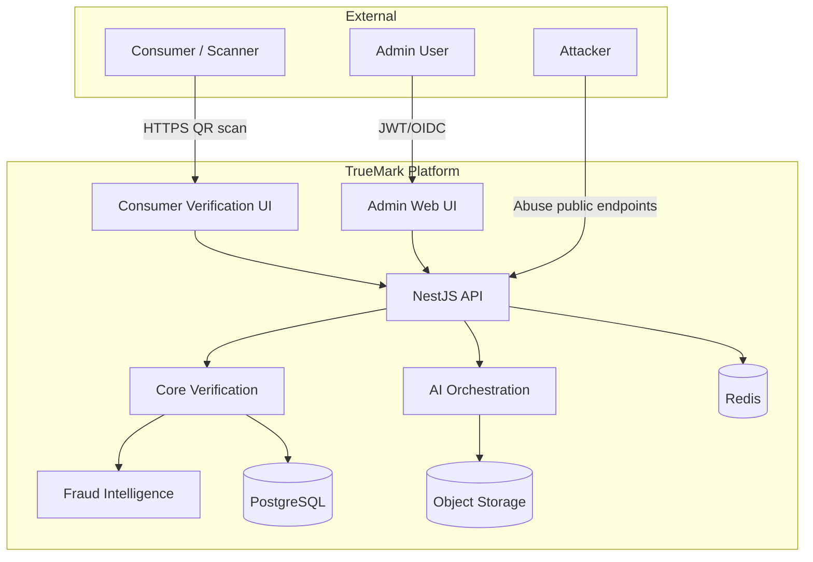

# TrueMark Threat Model

> Formal threat model for the TrueMark product authentication platform.  
> Methodology: STRIDE-inspired analysis mapped to product-specific attack surfaces.

## Scope

This document covers threats against:

- **Consumer verification flow** (public, unauthenticated)
- **Admin portal** (authenticated, RBAC)
- **Multi-tenant data plane** (tenant isolation)
- **Domain and URL handling** (verification domains, QR URLs)
- **QR and credential system** (generation, validation, lifecycle)
- **AI validation layer** (optional, image-based)
- **Infrastructure** (cloud, on-prem, hybrid deployments)

**Out of scope:** Physical supply chain attacks (label tampering before QR application), social engineering of end consumers beyond platform mitigations.

---

## System Context



---

## Assets

| Asset                             | Classification     | Impact if Compromised                      |
| --------------------------------- | ------------------ | ------------------------------------------ |
| Verification credentials (tokens) | Secret             | Forge authentic verifications              |
| QR token → product mapping        | Confidential       | Enumerate or clone products                |
| Tenant data (products, batches)   | Confidential       | Cross-tenant data breach                   |
| Admin credentials / JWT           | Secret             | Full tenant or platform compromise         |
| Verification history              | Confidential       | Privacy breach, intelligence for attackers |
| AI reference images               | Confidential       | Improve counterfeit quality                |
| Domain configuration              | Integrity-critical | Redirect consumers to fake portals         |
| Audit logs                        | Integrity-critical | Hide attacker activity                     |
| Signing/hashing keys              | Secret             | Credential forgery                         |

---

## Threat Catalog

### T-01: QR Enumeration

| Field             | Value                                                                                                                                                                                                  |
| ----------------- | ------------------------------------------------------------------------------------------------------------------------------------------------------------------------------------------------------ |
| **Threat**        | Attacker systematically guesses or scans QR token URLs to discover valid credentials                                                                                                                   |
| **Impact**        | High — valid tokens discovered, product mapping exposed, clone detection evaded                                                                                                                        |
| **Likelihood**    | Medium — depends on token entropy and rate limits                                                                                                                                                      |
| **Mitigation**    | ≥128-bit cryptographically random tokens; no sequential/predictable patterns; rate limiting per IP/fingerprint; generic error for invalid tokens (no oracle); prefix index without full token exposure |
| **Residual risk** | Low — with proper entropy and rate limits, brute force is infeasible                                                                                                                                   |

### T-02: QR Cloning

| Field             | Value                                                                                                                                                                                                                    |
| ----------------- | ------------------------------------------------------------------------------------------------------------------------------------------------------------------------------------------------------------------------ |
| **Threat**        | Attacker copies a valid QR code onto counterfeit products                                                                                                                                                                |
| **Impact**        | High — counterfeit products appear verified                                                                                                                                                                              |
| **Likelihood**    | High — physical attack, always possible for individual QRs                                                                                                                                                               |
| **Mitigation**    | Re-verification detection (REVERIFIED result); high-frequency scan fraud signals; geographic anomaly detection; impossible travel detection; consumer education; optional AI physical validation; investigation workflow |
| **Residual risk** | Medium — digital verification cannot alone prevent physical QR duplication; fraud intelligence reduces window                                                                                                            |

### T-03: Serial Cloning

| Field             | Value                                                                                                                  |
| ----------------- | ---------------------------------------------------------------------------------------------------------------------- |
| **Threat**        | Attacker duplicates serial numbers across counterfeit units                                                            |
| **Impact**        | High — batch integrity compromised                                                                                     |
| **Likelihood**    | Medium                                                                                                                 |
| **Mitigation**    | Serial uniqueness constraint per tenant; serial reuse fraud signal; manual code linked to credential, not serial alone |
| **Residual risk** | Low-Medium — detected by reuse intelligence                                                                            |

### T-04: Verification Code Guessing

| Field             | Value                                                                                                                                              |
| ----------------- | -------------------------------------------------------------------------------------------------------------------------------------------------- |
| **Threat**        | Attacker brute-forces manual verification codes                                                                                                    |
| **Impact**        | High — unauthorized verification lookup                                                                                                            |
| **Likelihood**    | Medium — if codes are short or predictable                                                                                                         |
| **Mitigation**    | High-entropy codes (same as QR tokens); Argon2 hash storage; prefix lookup + verify (not full scan); strict rate limiting; lockout after threshold |
| **Residual risk** | Low                                                                                                                                                |

### T-05: Tenant Escape

| Field             | Value                                                                                                                                                                                                   |
| ----------------- | ------------------------------------------------------------------------------------------------------------------------------------------------------------------------------------------------------- |
| **Threat**        | Attacker manipulates `tenantId` in API requests to access another tenant's data                                                                                                                         |
| **Impact**        | Critical — full cross-tenant data breach                                                                                                                                                                |
| **Likelihood**    | Low — requires application bug                                                                                                                                                                          |
| **Mitigation**    | `TenantGuard` derives tenant from JWT claims, never request body; every query includes `tenantId` filter; integration tests for isolation; code review checklist; platform admin role explicitly scoped |
| **Residual risk** | Low — defense in depth required; periodic penetration testing                                                                                                                                           |

### T-06: Domain Spoofing

| Field             | Value                                                                                                                                                                                                              |
| ----------------- | ------------------------------------------------------------------------------------------------------------------------------------------------------------------------------------------------------------------ |
| **Threat**        | Attacker registers similar domain (e.g., `verify-abcpharma.com`) or compromises DNS to serve fake verification portal                                                                                              |
| **Impact**        | High — consumers trust counterfeit results                                                                                                                                                                         |
| **Likelihood**    | Medium                                                                                                                                                                                                             |
| **Mitigation**    | Exact hostname match against registered verification domains; DNS TXT ownership verification before domain activation; HTTPS-only; HSTS; consumer education; no wildcard domain acceptance without explicit config |
| **Residual risk** | Medium — typosquatting outside platform control; recommend tenant brand protection                                                                                                                                 |

### T-07: Host Header / Open Redirect Attacks

| Field             | Value                                                                                                                                                                                                             |
| ----------------- | ----------------------------------------------------------------------------------------------------------------------------------------------------------------------------------------------------------------- |
| **Threat**        | Attacker manipulates Host header or redirect parameters to redirect consumers to malicious sites                                                                                                                  |
| **Impact**        | High — phishing via trusted verification flow                                                                                                                                                                     |
| **Likelihood**    | Medium                                                                                                                                                                                                            |
| **Mitigation**    | Hostname resolved from TLS SNI / configured ingress, not raw Host header alone; no user-controlled redirect URLs; URL parsing validates protocol (HTTPS only) and hostname match; allowlist for any outbound URLs |
| **Residual risk** | Low                                                                                                                                                                                                               |

### T-08: Fake Verification Portal (Phishing)

| Field             | Value                                                                                                                                                                                                      |
| ----------------- | ---------------------------------------------------------------------------------------------------------------------------------------------------------------------------------------------------------- |
| **Threat**        | Attacker creates visually identical verification page on different domain                                                                                                                                  |
| **Impact**        | High — false verification results shown                                                                                                                                                                    |
| **Likelihood**    | Medium                                                                                                                                                                                                     |
| **Mitigation**    | Consumer UI served only from verified tenant domains; visual branding tied to registered tenant; educational messaging ("verify the URL"); optional certificate transparency monitoring for tenant domains |
| **Residual risk** | Medium — outside direct platform control                                                                                                                                                                   |

### T-09: API Abuse / Bot Scanning

| Field             | Value                                                                                                                                                     |
| ----------------- | --------------------------------------------------------------------------------------------------------------------------------------------------------- |
| **Threat**        | Automated bots flood verification endpoints for enumeration, DoS, or intelligence gathering                                                               |
| **Impact**        | Medium — service degradation, intelligence leak                                                                                                           |
| **Likelihood**    | High                                                                                                                                                      |
| **Mitigation**    | Rate limiting (`RATE_LIMIT_VERIFY_PER_MIN`); WAF/CDN protection; CAPTCHA on suspicious patterns (future); correlation ID tracking; IP reputation (future) |
| **Residual risk** | Low-Medium — distributed bots harder to block                                                                                                             |

### T-10: Admin Account Compromise

| Field             | Value                                                                                                                                                                               |
| ----------------- | ----------------------------------------------------------------------------------------------------------------------------------------------------------------------------------- |
| **Threat**        | Attacker obtains admin credentials via phishing, credential stuffing, or session hijacking                                                                                          |
| **Impact**        | Critical — tenant data manipulation, QR revocation, credential export                                                                                                               |
| **Likelihood**    | Medium                                                                                                                                                                              |
| **Mitigation**    | OIDC/MFA in production; JWT short expiry; RBAC least privilege; audit logging on all admin actions; no password auth in production (OIDC only); session invalidation on role change |
| **Residual risk** | Low-Medium — MFA adoption depends on IdP                                                                                                                                            |

### T-11: AI Abuse / Manipulation

| Field             | Value                                                                                                                                                                                                                           |
| ----------------- | ------------------------------------------------------------------------------------------------------------------------------------------------------------------------------------------------------------------------------- |
| **Threat**        | Attacker submits adversarial images, deepfakes, or prompt injection to bypass AI validation                                                                                                                                     |
| **Impact**        | Medium — false AI confidence, wasted quota                                                                                                                                                                                      |
| **Likelihood**    | Medium                                                                                                                                                                                                                          |
| **Mitigation**    | AI is optional and never overrides invalid core verification; image quality gates; AI confidence is informational only; rate limiting on AI endpoints; model versioning and audit; no LLM prompt injection surface on core path |
| **Residual risk** | Medium — AI vision attacks evolving; human review for high-value products                                                                                                                                                       |

### T-12: AI Scope Creep (Invalid → Verified)

| Field             | Value                                                                                                                                       |
| ----------------- | ------------------------------------------------------------------------------------------------------------------------------------------- |
| **Threat**        | Bug or misconfiguration allows AI result to upgrade INVALID/REVOKED to VERIFIED                                                             |
| **Impact**        | Critical — authentication bypass                                                                                                            |
| **Likelihood**    | Low — design prevents this                                                                                                                  |
| **Mitigation**    | Hard module boundary: `CoreVerificationService` never calls AI; AI results stored separately; acceptance test 15 enforced; code review gate |
| **Residual risk** | Very Low                                                                                                                                    |

### T-13: Data Leakage via Public IDs

| Field             | Value                                                                                                                                                       |
| ----------------- | ----------------------------------------------------------------------------------------------------------------------------------------------------------- |
| **Threat**        | Internal database UUIDs exposed in public API responses enabling correlation attacks                                                                        |
| **Impact**        | Medium — information disclosure                                                                                                                             |
| **Likelihood**    | Medium                                                                                                                                                      |
| **Mitigation**    | Public verification responses use `verificationPublicId` only; no internal IDs in consumer responses; product snapshot is denormalized at verification time |
| **Residual risk** | Low                                                                                                                                                         |

### T-14: Reference Data Tampering

| Field             | Value                                                                                                                                                                               |
| ----------------- | ----------------------------------------------------------------------------------------------------------------------------------------------------------------------------------- |
| **Threat**        | Insider or compromised admin replaces AI reference images with counterfeit versions                                                                                                 |
| **Impact**        | High — AI validation weakened                                                                                                                                                       |
| **Likelihood**    | Low                                                                                                                                                                                 |
| **Mitigation**    | Reference data versioned; upload requires admin role; audit log on reference data changes; object storage integrity (checksums); separation of duties for reference data management |
| **Residual risk** | Low                                                                                                                                                                                 |

### T-15: Secret Leakage

| Field             | Value                                                                                                                                       |
| ----------------- | ------------------------------------------------------------------------------------------------------------------------------------------- |
| **Threat**        | JWT secrets, database credentials, or AI API keys committed to source control or logged                                                     |
| **Impact**        | Critical — full platform compromise                                                                                                         |
| **Likelihood**    | Low                                                                                                                                         |
| **Mitigation**    | `.env` gitignored; secret provider abstraction; no secrets in logs; pre-commit hooks; container secrets via K8s/Vault; key rotation runbook |
| **Residual risk** | Low                                                                                                                                         |

### T-16: SSRF via Domain Verification

| Field             | Value                                                                                                                                                                  |
| ----------------- | ---------------------------------------------------------------------------------------------------------------------------------------------------------------------- |
| **Threat**        | Attacker configures domain verification to probe internal network                                                                                                      |
| **Impact**        | High — internal network reconnaissance                                                                                                                                 |
| **Likelihood**    | Low                                                                                                                                                                    |
| **Mitigation**    | DNS TXT verification only (no HTTP callback to user URLs); no user-supplied URLs fetched server-side; domain URL validation rejects IP literals and internal hostnames |
| **Residual risk** | Very Low                                                                                                                                                               |

### T-17: Location Privacy

| Field             | Value                                                                                                                                       |
| ----------------- | ------------------------------------------------------------------------------------------------------------------------------------------- |
| **Threat**        | Consumer geolocation stored without consent or retained beyond necessity                                                                    |
| **Impact**        | Medium — privacy violation, regulatory risk                                                                                                 |
| **Likelihood**    | Medium                                                                                                                                      |
| **Mitigation**    | Location optional; coarse-grained storage (country/region default); consent prompt in consumer UI; retention policy; GDPR compliance review |
| **Residual risk** | Low — pending legal review                                                                                                                  |

### T-18: Insider Threat

| Field             | Value                                                                                                                                        |
| ----------------- | -------------------------------------------------------------------------------------------------------------------------------------------- |
| **Threat**        | Malicious tenant admin exports credentials, revokes legitimate QRs, or manipulates product data                                              |
| **Impact**        | High — tenant-specific damage                                                                                                                |
| **Likelihood**    | Low                                                                                                                                          |
| **Mitigation**    | RBAC least privilege; audit logs immutable; bulk export requires elevated role; platform admin oversight; anomaly detection on admin actions |
| **Residual risk** | Low-Medium — tenant admins are trusted within their boundary                                                                                 |

### T-19: Denial of Service

| Field             | Value                                                                                                                                            |
| ----------------- | ------------------------------------------------------------------------------------------------------------------------------------------------ |
| **Threat**        | Attacker overwhelms verification API, database, or Redis                                                                                         |
| **Impact**        | Medium — service unavailability                                                                                                                  |
| **Likelihood**    | Medium                                                                                                                                           |
| **Mitigation**    | Rate limiting; horizontal scaling; connection pooling; CDN for static assets; Redis-backed throttling; circuit breakers; DDoS protection at edge |
| **Residual risk** | Low-Medium — volumetric attacks require infra-level mitigation                                                                                   |

### T-20: Supply Chain / Dependency Compromise

| Field             | Value                                                                                                                  |
| ----------------- | ---------------------------------------------------------------------------------------------------------------------- |
| **Threat**        | Vulnerable or malicious npm dependency                                                                                 |
| **Impact**        | Critical — RCE, data exfiltration                                                                                      |
| **Likelihood**    | Low                                                                                                                    |
| **Mitigation**    | Dependency scanning in CI; lockfile committed; regular updates; minimal dependency footprint; container image scanning |
| **Residual risk** | Low                                                                                                                    |

### T-21: Backup / DR Data Exposure

| Field             | Value                                                                                                                 |
| ----------------- | --------------------------------------------------------------------------------------------------------------------- |
| **Threat**        | Unencrypted backups containing credentials or PII accessed by unauthorized party                                      |
| **Impact**        | Critical                                                                                                              |
| **Likelihood**    | Low                                                                                                                   |
| **Mitigation**    | Encrypted backups; access-controlled backup storage; backup retention policy; restore testing in isolated environment |
| **Residual risk** | Low                                                                                                                   |

### T-22: Hybrid Boundary Violation

| Field             | Value                                                                                                                                  |
| ----------------- | -------------------------------------------------------------------------------------------------------------------------------------- |
| **Threat**        | Data classified as on-prem only crosses to cloud AI component                                                                          |
| **Impact**        | High — contractual/regulatory breach                                                                                                   |
| **Likelihood**    | Medium — configuration error                                                                                                           |
| **Mitigation**    | Data classification tags; hybrid config validation; network policies; audit of cross-boundary transfers; explicit opt-in per data type |
| **Residual risk** | Low — with proper config review                                                                                                        |

---

## Attack Trees (Selected)

### QR Cloning Attack Tree

```
Goal: Sell counterfeit product that appears verified
├── Copy valid QR label
│   ├── Obtain QR from genuine product (physical access) ✓ always possible
│   └── Apply to counterfeit unit
│       ├── First scan → VERIFIED (expected)
│       └── Subsequent scans → REVERIFIED + fraud signals
│           ├── High frequency → POSSIBLE_CLONE alert
│           ├── Geographic spread → IMPOSSIBLE_TRAVEL alert
│           └── AI mismatch → AI_PHYSICAL_MISMATCH signal
└── Forge QR token
    ├── Brute force → mitigated by entropy + rate limits
    └── Compromise credential DB → mitigated by Argon2 hashing
```

### Tenant Escape Attack Tree

```
Goal: Access Tenant B data as Tenant A admin
├── Manipulate tenantId in request body → blocked by TenantGuard
├── JWT tampering → blocked by signature verification
├── IDOR on resource UUID → blocked if tenantId filter enforced
└── Platform admin abuse → mitigated by audit + least privilege
```

---

## Security Controls Matrix

| Control                     | Threats Addressed      | Implementation                               |
| --------------------------- | ---------------------- | -------------------------------------------- |
| High-entropy tokens         | T-01, T-04             | `CredentialService` token generation         |
| Argon2 hashing              | T-01, T-04, T-15       | `verification_credentials.token_hash`        |
| TenantGuard                 | T-05                   | `apps/api/src/common/guards/tenant.guard.ts` |
| RolesGuard                  | T-10, T-18             | `@Roles()` decorator + guard                 |
| Domain hostname lookup      | T-06, T-07             | `DomainService.resolveTenantByHostname`      |
| HTTPS enforcement           | T-06, T-07, T-08       | URL validation in core verification          |
| Rate limiting               | T-01, T-04, T-09, T-11 | `@nestjs/throttler`                          |
| Audit logging               | T-10, T-14, T-18       | `AuditService`                               |
| Fraud signals               | T-02, T-03             | `SignalEvaluatorService`                     |
| AI module isolation         | T-11, T-12             | Separate `AiOrchestrationModule`             |
| Secret provider abstraction | T-15                   | `EnvSecretProvider` + future Vault           |
| Correlation IDs             | T-09, T-10             | `CorrelationInterceptor`                     |

---

## Trust Boundaries

| Boundary                 | Trust Level      | Controls                                       |
| ------------------------ | ---------------- | ---------------------------------------------- |
| Internet → Consumer UI   | Untrusted        | HTTPS, CSP, no admin routes                    |
| Internet → Public API    | Untrusted        | Rate limit, input validation, no internal IDs  |
| Internet → Admin API     | Semi-trusted     | JWT/OIDC, RBAC, tenant guard                   |
| API → Database           | Trusted internal | Parameterized queries (Prisma), tenant filters |
| API → AI Provider        | Semi-trusted     | API key rotation, no PII in prompts, timeout   |
| On-prem ↔ Cloud (hybrid) | Configurable     | mTLS, data classification, explicit allowlists |

---

## Residual Risk Summary

| Risk Level             | Count | Acceptable?                                                                                     |
| ---------------------- | ----- | ----------------------------------------------------------------------------------------------- |
| Critical (unmitigated) | 0     | —                                                                                               |
| High residual          | 2     | T-02 (QR cloning), T-06 (domain spoofing) — accepted with fraud intelligence + tenant education |
| Medium residual        | 4     | T-09, T-11, T-17, T-19 — monitor and iterate                                                    |
| Low residual           | 16    | Accepted                                                                                        |

---

## Validation Plan (Phase 14)

- [ ] Penetration test covering T-01 through T-10
- [ ] Tenant isolation integration test suite (automated)
- [ ] QR enumeration load test with rate limit verification
- [ ] AI boundary code review (no AI imports in core verification module)
- [ ] Domain spoofing test with unregistered hostnames
- [ ] Secret scanning in CI (gitleaks/trufflehog)
- [ ] Dependency audit (npm audit, Snyk)
- [ ] Backup restore drill with data integrity verification
- [ ] Hybrid boundary test with data classification enforcement

---

## Review Schedule

| Event                       | Frequency                       |
| --------------------------- | ------------------------------- |
| Threat model review         | Each major phase completion     |
| Penetration test            | Annually + before major release |
| Control effectiveness audit | Quarterly                       |
| Incident-driven update      | Within 48h of security incident |

---

## References

- [Core Verification Architecture](./architecture/CORE_VERIFICATION.md)
- [Tenant & Domain Model](./architecture/TENANT_DOMAIN.md)
- [AI Boundary](./architecture/AI.md)
- [Production Readiness](./PRODUCTION_READINESS.md)
