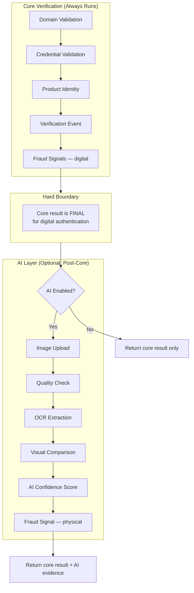
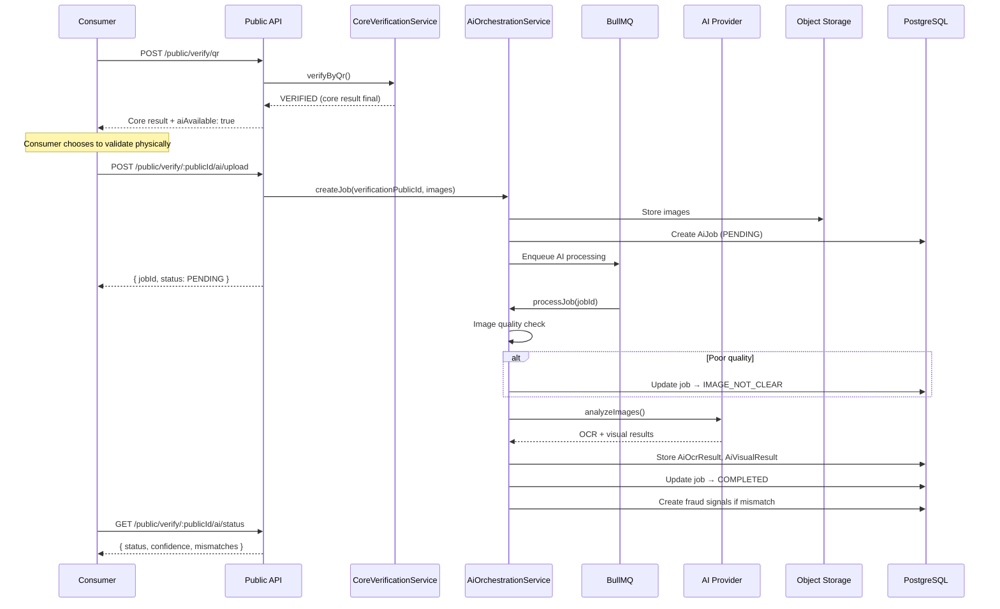

# AI Boundary Architecture

> Defines the strict separation between core digital verification and optional AI-based physical validation.

## Fundamental Rule

**AI never replaces, overrides, or gates core digital verification.**

- A scan of an invalid/revoked/blocked QR **cannot** become `VERIFIED` through AI
- AI confidence is **informational**, not proof of authenticity
- AI may be disabled entirely — the platform must function fully without it
- AI processing is **never synchronous** on the core QR verification hot path

---

## Boundary Diagram



---

## Responsibility Matrix

| Capability | Core | AI |
|------------|:----:|:--:|
| Domain validation | ✓ | |
| Tenant resolution | ✓ | |
| QR/credential validation | ✓ | |
| Product identity lookup | ✓ | |
| Serial validation | ✓ | |
| Lifecycle state check | ✓ | |
| Verification history | ✓ | |
| Repeat verification detection | ✓ | |
| Digital clone signals (frequency, geo) | ✓ | |
| Image quality assessment | | ✓ |
| OCR (batch, serial, expiry) | | ✓ |
| Packaging visual comparison | | ✓ |
| Logo verification | | ✓ |
| Security feature detection | | ✓ |
| Reference image comparison | | ✓ |
| AI confidence scoring | | ✓ |
| Physical mismatch signals | | ✓ |

---

## AI Modes

Configured per tenant via `AiConfig.mode`:

| Mode | Behavior |
|------|----------|
| `AI_DISABLED` | No AI UI shown; no AI endpoints accessible; `aiAvailable: false` |
| `AI_OPTIONAL` | Consumer offered AI step after core verification; may skip |
| `AI_REQUIRED` | Consumer must complete AI validation for full result; core still runs first |

Mode changes require `TENANT_ADMIN` role and are audit-logged.

---

## AI Flow (Post-Core)



---

## AI Job States

| Status | Meaning |
|--------|---------|
| `PENDING` | Queued for processing |
| `PROCESSING` | AI provider analyzing |
| `COMPLETED` | Results available |
| `FAILED` | Provider error (retryable) |
| `IMAGE_NOT_CLEAR` | Quality gate rejected images |
| `AI_NOT_CONFIGURED` | Provider not configured — **no fabricated results** |
| `AI_UNAVAILABLE` | Provider unreachable — core result unaffected |

---

## AI Provider Abstraction

```typescript
interface AiProvider {
  analyzeImages(input: {
    images: { viewAngle: ImageViewAngle; data: Buffer }[];
    referenceImages: { viewAngle: ImageViewAngle; objectKey: string }[];
    productSnapshot: ProductSnapshot;
    config: AiConfigSettings;
  }): Promise<{
    ocrResults: OcrResult[];
    visualResults: VisualResult[];
    confidence: number;
    model: string;
    modelVersion: string;
  }>;
}
```

Implementations:

| Provider | Env Value | Use Case |
|----------|-----------|----------|
| Mock | `AI_PROVIDER=mock` | Development, testing |
| OpenAI | `AI_PROVIDER=openai` | Cloud SaaS |
| Azure AI | `AI_PROVIDER=azure` | Enterprise cloud |
| Local model | Custom provider | On-prem / air-gapped |

Selection via `AI_PROVIDER` environment variable. API key via `AI_API_KEY` or secret provider.

---

## Reference Data

AI visual comparison requires reference images uploaded by tenant admins:

```
AiReferenceData
  ├── scope: "product" | "variant" | "tenant"
  ├── scopeId: UUID (optional)
  ├── objectKey: storage path
  ├── version: int
  └── metadata: { angles, description }
```

**Security:**
- Reference data is tenant-scoped
- Upload requires admin role
- Changes are versioned and audit-logged
- Stored in tenant's object storage (respects hybrid boundaries)

---

## AI Quotas

Each tenant has an AI quota (`AiConfig.quota`) — maximum AI jobs per billing period.

- Quota checked before job creation
- Exceeded → HTTP 429 with clear message
- Quota does not affect core verification (always unlimited)
- Platform admin can adjust quotas

Rate limiting: `RATE_LIMIT_AI_PER_MIN` (default 10/min per IP).

---

## AI Governance

Every AI execution records:

| Field | Purpose |
|-------|---------|
| `provider` | Which AI service processed the request |
| `model` | Model identifier |
| `modelVersion` | Specific model version |
| `configVersion` | Tenant AI config version at execution time |
| `confidence` | Model confidence (informational) |
| `result` | Full JSON result for audit |
| `createdAt` / `completedAt` | Timing |

AI results are **never deleted** — append-only audit trail.

Known limitations must be documented per model and surfaced to admins.

---

## What AI Cannot Do

| Prohibited | Enforcement |
|-----------|-------------|
| Override INVALID → VERIFIED | Core result returned independently |
| Override REVOKED → VERIFIED | AI job rejected if core result is terminal |
| Fabricate results when provider unavailable | Returns `AI_NOT_CONFIGURED` or `AI_UNAVAILABLE` |
| Run on core verification path | Module import boundary |
| Store consumer images beyond retention period | Configurable retention + purge job |
| Send images to provider without tenant consent | Hybrid config + data classification |

---

## Failure Handling

| Scenario | Behavior |
|----------|----------|
| AI provider down | Core verification unaffected; AI job → `AI_UNAVAILABLE` |
| AI quota exceeded | Core unaffected; new AI jobs rejected |
| Poor image quality | Job → `IMAGE_NOT_CLEAR`; consumer prompted to retake |
| AI timeout | Job → `FAILED`; retry available |
| Hybrid link down (on-prem AI) | Core unaffected; AI queued until link restored |

**Graceful degradation is mandatory.** Core verification must succeed even if every AI component is offline.

---

## Image Requirements

Configured per tenant in `AiConfig.config`:

```json
{
  "requiredViews": ["FRONT", "BACK"],
  "optionalViews": ["LEFT", "RIGHT"],
  "minResolution": { "width": 1024, "height": 768 },
  "maxFileSizeMb": 10,
  "acceptedFormats": ["image/jpeg", "image/png"],
  "qualityThresholds": {
    "minSharpness": 0.6,
    "minBrightness": 0.3,
    "maxBrightness": 0.9
  }
}
```

---

## Testing Requirements

| Test | Expected |
|------|----------|
| AI disabled, scan valid QR | Core succeeds; no AI UI/endpoints |
| AI provider not configured | `AI_NOT_CONFIGURED`; no fabricated results |
| Invalid QR + AI attempt | AI rejected; core result remains INVALID |
| AI confidence displayed | Separate from verification result |
| AI job audit trail | Provider, model, version recorded |

---

## Module Structure

```
apps/api/src/modules/
├── ai-config/           # Configuration, reference data, quotas
│   ├── ai-config.controller.ts
│   ├── ai-config.service.ts
│   └── ai-config.module.ts
├── ai-orchestration/    # Job creation, processing, status
│   ├── ai-orchestration.controller.ts
│   ├── ai-orchestration.service.ts
│   └── ai-orchestration.module.ts
└── verification/        # Core only — NO ai imports
    ├── core-verification.service.ts
    └── public-verification.controller.ts

apps/api/src/providers/ai/
└── mock-ai.provider.ts  # Development provider
```

---

## Related Documents

- [Core Verification Flow](./CORE_VERIFICATION.md)
- [System Architecture](./SYSTEM.md)
- [Hybrid Deployment](./HYBRID.md) — AI in hybrid scenarios
- [Threat Model](../THREAT_MODEL.md) — T-11, T-12
