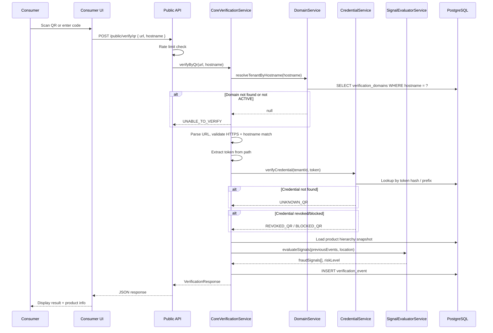

# Core Verification Flow

> Architecture for digital product identity verification — the heart of TrueMark.  
> **This flow never invokes AI, OCR, or image processing.**

## Principles

1. Consumer does not require login
2. Core verification is **fast** (target p95 < 200ms)
3. Core verification is **digital identity authentication** — not physical proof
4. A valid QR proves the credential exists in TrueMark; it does not prove the physical product is genuine
5. Invalid, revoked, or blocked credentials **cannot** become verified through any other mechanism
6. Every verification event is persisted (append-only) and auditable
7. Repeat scans are detected and reported differently from first verification

---

## Verification Methods

| Method      | Input                 | Entry Point                |
| ----------- | --------------------- | -------------------------- |
| QR Scan     | Full verification URL | `POST /public/verify/qr`   |
| Manual Code | Alphanumeric code     | `POST /public/verify/code` |

Both methods converge into a shared credential validation pipeline.

---

## End-to-End Flow



---

## Step-by-Step: QR Verification

### Step 1 — Rate Limiting

Public endpoints are protected by `@nestjs/throttler`:

- Default: 60 requests/minute per IP (`RATE_LIMIT_VERIFY_PER_MIN`)
- Exceeded → HTTP 429

### Step 2 — Domain Resolution

```
Input: hostname from request (e.g., "verify.abcpharma.com")
Query: verification_domains WHERE hostname = ? AND status = 'ACTIVE'
Output: { tenantId, id, version, verificationPath }
```

If no match → `UNABLE_TO_VERIFY` (generic, no information leak).

### Step 3 — URL Validation

```typescript
// Enforced in CoreVerificationService.verifyByQr()
parsedUrl.protocol === 'https:';
parsedUrl.hostname.toLowerCase() === hostname.toLowerCase();
```

Reject:

- HTTP (non-TLS) URLs
- Hostname mismatch (prevents URL manipulation)
- Malformed URLs

### Step 4 — Token Extraction

QR URL format: `https://{verification-domain}/v/{token}`

The token is the last path segment after the configured `verificationPath` prefix.

Example: `https://verify.abcpharma.com/v/Xk9mN2pQ7rT4vW8yZ1aB3cD5eF6gH7i`

### Step 5 — Credential Validation

```
1. Normalize token
2. Compute prefix (first 8 chars) for indexed lookup
3. Query verification_credentials WHERE tenantId = ? AND tokenPrefix = ?
4. For each candidate: argon2.verify(storedHash, token)
5. Match found → proceed; no match → UNKNOWN_QR
```

**Security properties:**

- Tokens have ≥128-bit entropy
- Stored as Argon2 hash (not plaintext in credentials table)
- Prefix index enables fast lookup without exposing full token
- Lookup scoped to resolved tenantId (no cross-tenant search)

### Step 6 — Lifecycle Check

Check credential, QR code, product unit, and batch lifecycle status:

| Status             | Result             |
| ------------------ | ------------------ |
| ACTIVE             | Continue           |
| REVOKED            | `REVOKED_QR`       |
| BLOCKED            | `BLOCKED_QR`       |
| SUSPENDED          | `SUSPENDED`        |
| RECALLED           | `RECALLED`         |
| INACTIVE / RETIRED | `UNABLE_TO_VERIFY` |

### Step 7 — Product Identity Resolution

Load and denormalize product hierarchy:

```
ProductUnit → Batch → ProductVariant → Product → Brand → Manufacturer
                                                      → Serial
```

Product snapshot stored on verification event for historical accuracy (product name changes don't alter past records).

### Step 8 — Repeat Verification Detection

Query previous verification events for same product unit:

| Condition                | Result                                          |
| ------------------------ | ----------------------------------------------- |
| First verification ever  | `VERIFIED`                                      |
| Previous VERIFIED exists | `REVERIFIED`                                    |
| Fraud signals triggered  | May upgrade to `SUSPICIOUS` or `POSSIBLE_CLONE` |

### Step 9 — Fraud Signal Evaluation

`SignalEvaluatorService` evaluates:

| Signal                | Trigger                                       |
| --------------------- | --------------------------------------------- |
| `HIGH_SCAN_FREQUENCY` | > N scans in window (configurable per tenant) |
| `GEOGRAPHIC_ANOMALY`  | Scan from unusual location vs history         |
| `IMPOSSIBLE_TRAVEL`   | Two scans faster than physically possible     |
| `EXCESSIVE_QR_REUSE`  | Many scans across distant locations           |

Signals are persisted on the verification event. Risk level aggregated: LOW / MEDIUM / HIGH.

### Step 10 — Event Persistence

```sql
INSERT INTO verification_events (
  public_id,           -- consumer-facing ID
  tenant_id,
  product_unit_id,
  qr_code_id,
  verification_domain_id,
  method,              -- QR_SCAN | MANUAL_CODE
  result,
  risk_level,
  correlation_id,
  domain_config_version,
  product_snapshot,    -- JSON denormalized product info
  ip_address,
  user_agent
)
```

Verification events are **append-only** — never updated or deleted.

### Step 11 — Response

```json
{
  "result": "VERIFIED",
  "riskLevel": "LOW",
  "verificationPublicId": "550e8400-e29b-41d4-a716-446655440000",
  "product": {
    "name": "PainRelief 500mg",
    "brand": "ABC Pharma",
    "manufacturer": "ABC Pharmaceuticals Ltd",
    "batch": "B2024-001",
    "serial": "SN-00012345",
    "sku": "PR-500-60"
  },
  "message": "This product is registered and verified.",
  "aiAvailable": false,
  "aiMode": "AI_DISABLED",
  "correlationId": "abc-123-def"
}
```

**Response rules:**

- No internal database IDs exposed
- `aiAvailable` / `aiMode` inform consumer UI whether AI step is offered
- Generic message for failure cases (no oracle)

---

## Manual Code Verification

Same pipeline except:

1. Input is normalized alphanumeric code (not URL)
2. Prefix lookup on `verification_credentials.tokenPrefix`
3. Argon2 verify against candidates
4. Method recorded as `MANUAL_CODE`

Manual codes use the same high-entropy tokens as QR credentials — they are not short guessable PINs.

---

## Verification Results

| Result                  | Meaning                            | Consumer Message                   |
| ----------------------- | ---------------------------------- | ---------------------------------- |
| `VERIFIED`              | First successful verification      | Product is registered and verified |
| `REVERIFIED`            | Subsequent successful verification | Product verified again             |
| `SUSPICIOUS`            | Verified but fraud signals present | Verified with caution              |
| `POSSIBLE_CLONE`        | High-confidence clone indicators   | Possible counterfeit detected      |
| `POSSIBLE_COUNTERFEIT`  | Strong counterfeit evidence        | Possible counterfeit               |
| `CONFIRMED_COUNTERFEIT` | Investigation confirmed            | Confirmed counterfeit              |
| `INVALID_QR`            | Malformed or tampered input        | Unable to verify                   |
| `UNKNOWN_QR`            | Token not found                    | Product not recognized             |
| `REVOKED_QR`            | Credential revoked                 | This code has been revoked         |
| `BLOCKED_QR`            | Credential blocked                 | This code has been blocked         |
| `EXPIRED`               | Batch/product expired              | Product expired                    |
| `RECALLED`              | Product recalled                   | Product recalled                   |
| `SUSPENDED`             | Tenant/product suspended           | Verification unavailable           |
| `UNABLE_TO_VERIFY`      | System/domain error                | Unable to verify at this time      |

---

## What Core Verification Does NOT Do

| Excluded                    | Reason                                |
| --------------------------- | ------------------------------------- |
| AI image analysis           | Separate optional layer (Phase 7-8)   |
| OCR                         | AI layer only                         |
| Camera access               | Not required for digital verification |
| Consumer authentication     | Product principle                     |
| Physical product inspection | Requires AI or human investigation    |
| Proof of purchase           | Out of scope                          |

---

## Performance Requirements

| Metric           | Target               |
| ---------------- | -------------------- |
| p50 latency      | < 50ms               |
| p95 latency      | < 200ms              |
| p99 latency      | < 500ms              |
| Database queries | ≤ 5 per verification |
| External calls   | 0 on core path       |

Optimizations:

- Domain resolution cacheable in Redis (TTL 60s)
- Prefix index on credentials for O(1) lookup
- Product hierarchy loaded in single query with includes
- No synchronous external API calls

---

## Module Boundaries

```
PublicVerificationController
  └── CoreVerificationService          ← YOU ARE HERE
        ├── DomainService              (hostname → tenant)
        ├── CredentialService          (token → product unit)
        └── SignalEvaluatorService     (fraud signals)

  ✗ AiOrchestrationService             (NOT called)
  ✗ AiConfigService                    (NOT called)
```

Enforced by:

- Code review checklist
- Acceptance test 15 (AI disabled → no AI on scan)
- Module import restrictions

---

## Consumer Reporting

After verification, consumers may report suspicious products:

```
POST /public/report
{
  "verificationPublicId": "...",
  "reason": "PRODUCT_APPEARANCE_MISMATCH",
  "comment": "Packaging color differs"
}
```

No authentication required. Creates `ConsumerReport` linked to verification event. Triggers `CONSUMER_REPORT` fraud signal.

---

## Audit Trail

Every verification produces:

1. `verification_events` record (immutable)
2. Optional `verification_locations` record
3. Optional `fraud_signals` records
4. Correlation ID in logs

Admin can query verification history filtered by tenant, product, batch, date range, result type.

---

## Implementation Reference

| File                                                                  | Purpose                     |
| --------------------------------------------------------------------- | --------------------------- |
| `apps/api/src/modules/verification/core-verification.service.ts`      | Main verification logic     |
| `apps/api/src/modules/verification/public-verification.controller.ts` | Public HTTP endpoints       |
| `apps/api/src/modules/domain/domain.service.ts`                       | Domain resolution           |
| `apps/api/src/modules/credential/credential.service.ts`               | Token generation/validation |
| `apps/api/src/modules/fraud/signal-evaluator.service.ts`              | Fraud signal evaluation     |

---

## Related Documents

- [AI Boundary](./AI.md) — what happens after core verification
- [Tenant & Domain Model](./TENANT_DOMAIN.md) — domain resolution details
- [Threat Model](../THREAT_MODEL.md) — T-01 through T-04
