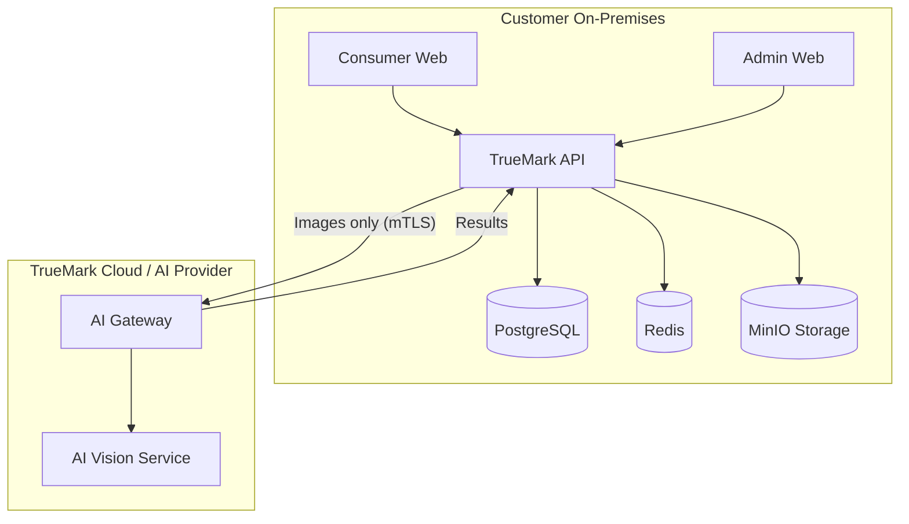
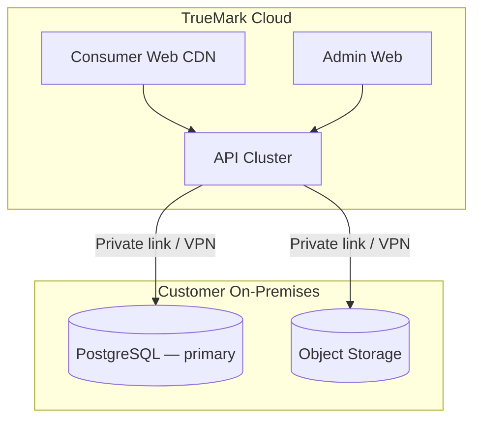
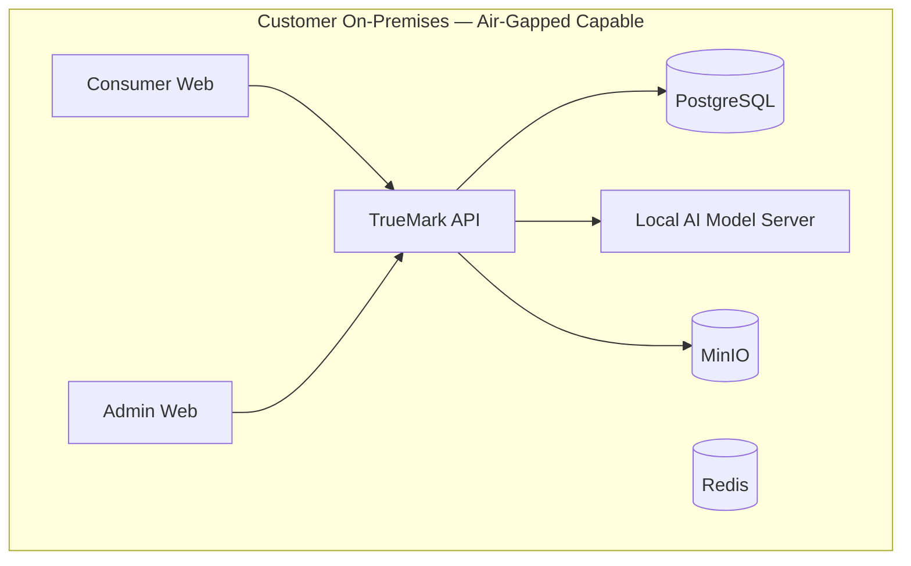
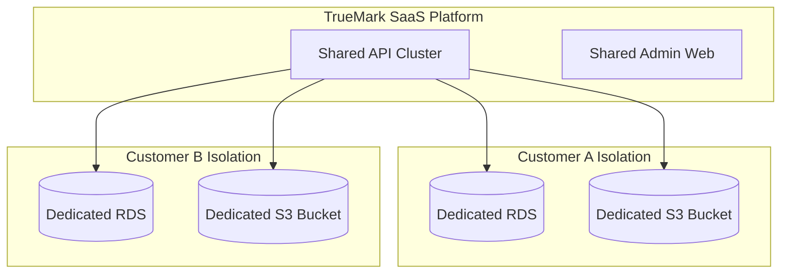
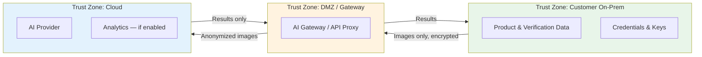
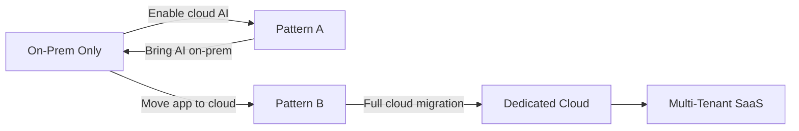

# Hybrid Deployment Architecture

> Configurable deployment patterns splitting TrueMark components across cloud and on-premises boundaries.

## Purpose

TrueMark must support customers who require:

- Core application and data on-premises (data residency)
- AI processing in cloud (GPU availability)
- Mixed storage (verification data local, analytics cloud)
- Gradual cloud migration (start on-prem, move components incrementally)

The hybrid architecture defines **trust boundaries**, **data flows**, and **failure behavior** for each supported pattern.

---

## Supported Patterns

### Pattern A: Core On-Prem + AI Cloud

Most common hybrid pattern. Customer keeps all product and verification data local; AI image analysis runs in cloud.



**Data that crosses boundary:** Consumer-uploaded product images only (explicit opt-in per tenant).  
**Data that stays on-prem:** All verification events, product data, credentials, audit logs.

### Pattern B: Core Cloud + Data On-Prem

TrueMark SaaS application in cloud; sensitive data store replicated or accessed on-prem.



**Use case:** Customer wants managed application but data must remain in their datacenter.  
**Requirement:** Low-latency private network connection (AWS Direct Connect, Azure ExpressRoute, VPN).

### Pattern C: Full On-Prem + Local AI

Everything including AI runs on-premises. No cloud dependency.



**Use case:** Pharmaceutical, defense, or regulated industries requiring air-gapped operation.  
**AI provider:** Self-hosted vision model (e.g., via Ollama, custom ONNX runtime).

### Pattern D: SaaS with Dedicated Database

Single-tenant SaaS — shared application layer, dedicated database and storage per customer.



**Use case:** Enterprise customers wanting SaaS convenience with data isolation guarantees.

---

## Trust Boundaries



### Boundary Rules

1. **Data classification required** — every data type tagged: `ON_PREM_ONLY`, `CLOUD_ALLOWED`, `TRANSIENT`
2. **Explicit opt-in** — no data crosses boundary without tenant configuration approval
3. **Encryption in transit** — mTLS minimum for hybrid links
4. **No credential export** — verification credentials never sent to cloud AI
5. **Audit cross-boundary transfers** — every hybrid data transfer logged

---

## Data Classification

| Data Type            | Default Classification | Pattern A    | Pattern B    | Pattern C |
| -------------------- | ---------------------- | ------------ | ------------ | --------- |
| Verification events  | ON_PREM_ONLY           | On-prem      | On-prem      | On-prem   |
| Product hierarchy    | ON_PREM_ONLY           | On-prem      | On-prem      | On-prem   |
| Credentials / tokens | ON_PREM_ONLY           | On-prem      | On-prem      | On-prem   |
| Consumer images      | TRANSIENT              | Cloud (AI)   | On-prem      | On-prem   |
| AI reference images  | ON_PREM_ONLY           | On-prem      | On-prem      | On-prem   |
| AI results           | ON_PREM_ONLY           | On-prem      | On-prem      | On-prem   |
| Audit logs           | ON_PREM_ONLY           | On-prem      | On-prem      | On-prem   |
| Analytics aggregates | CLOUD_ALLOWED          | Configurable | Configurable | On-prem   |
| Admin session tokens | ON_PREM_ONLY           | On-prem      | Cloud        | On-prem   |

---

## Network Requirements

### Pattern A (Core On-Prem + AI Cloud)

| Connection                     | Protocol | Port | Direction |
| ------------------------------ | -------- | ---- | --------- |
| Consumer → On-prem API         | HTTPS    | 443  | Inbound   |
| Admin → On-prem API            | HTTPS    | 443  | Inbound   |
| On-prem API → Cloud AI Gateway | mTLS     | 443  | Outbound  |
| On-prem → DNS                  | DNS      | 53   | Outbound  |

**Firewall rules:**

- Outbound HTTPS only to approved AI gateway endpoints
- No inbound from cloud to on-prem (except admin VPN)
- DNS allowlist for AI provider domains

### Pattern B (Core Cloud + Data On-Prem)

| Connection                  | Protocol | Port     | Direction            |
| --------------------------- | -------- | -------- | -------------------- |
| Cloud API → On-prem DB      | TLS      | 5432     | Outbound from cloud  |
| Cloud API → On-prem Storage | HTTPS    | 443/9000 | Outbound from cloud  |
| Admin VPN → On-prem         | HTTPS    | 443      | Inbound (admin only) |

**Requirements:**

- AWS Direct Connect / Azure ExpressRoute / VPN with < 10ms latency
- Database connection pooling with timeout/retry
- Storage proxy with local caching for hot objects

---

## Configuration

Hybrid deployment configured via environment and tenant settings:

```yaml
# Hybrid configuration (conceptual)
hybrid:
  mode: CORE_ONPREM_AI_CLOUD # Pattern identifier
  dataBoundary:
    verificationEvents: on_prem
    productData: on_prem
    consumerImages: cloud # Explicit opt-in
    aiResults: on_prem
  network:
    aiGatewayUrl: https://ai-gateway.truemark.io
    mtlsCertPath: /etc/truemark/certs/client.pem
    mtlsKeyPath: /etc/truemark/certs/client-key.pem
    caCertPath: /etc/truemark/certs/ca.pem
  failurePolicy:
    aiUnavailable: DEGRADE # Core continues; AI returns AI_UNAVAILABLE
    dbUnreachable: FAIL # Health check fails; no verification
    storageUnreachable: FAIL_FOR_AI # Core works; AI upload fails
```

Tenant `deploymentType: HYBRID` in database. Detailed hybrid config in tenant metadata or dedicated config service.

---

## Failure Behavior

| Component Failure          |       Core Verification       |  AI Validation   | Admin Portal |
| -------------------------- | :---------------------------: | :--------------: | :----------: |
| On-prem DB down            |            ✗ Fails            |     ✗ Fails      |   ✗ Fails    |
| On-prem Redis down         | ✓ Works (no cache/rate limit) |     ✓ Queued     |   ✓ Works    |
| On-prem Storage down       |            ✓ Works            |  ✗ Upload fails  |   ✓ Works    |
| Cloud AI down              |            ✓ Works            | ✗ AI_UNAVAILABLE |   ✓ Works    |
| Hybrid link down           |            ✓ Works            | ✗ AI_UNAVAILABLE |   ✓ Works    |
| Cloud API down (Pattern B) |            ✗ Fails            |     ✗ Fails      |   ✗ Fails    |

**Principle:** Core verification failure only when authoritative data store (PostgreSQL) is unreachable. All other failures degrade gracefully.

---

## Security Controls for Hybrid

| Control             | Implementation                                                 |
| ------------------- | -------------------------------------------------------------- |
| mTLS                | Client certificates for hybrid API connections                 |
| Network policies    | K8s NetworkPolicy / firewall rules restricting traffic         |
| Data minimization   | Only send required image data to cloud AI; strip EXIF/metadata |
| Image anonymization | Remove GPS EXIF before cloud transfer                          |
| Key separation      | On-prem keys never exported; cloud AI uses separate API keys   |
| Transfer audit      | Log every cross-boundary data transfer with classification tag |
| Timeout             | 30s timeout on hybrid links; circuit breaker after 3 failures  |
| Retry               | Exponential backoff for transient failures                     |

---

## Deployment Type Mapping

| `DeploymentType`  | Pattern             | Infrastructure                     |
| ----------------- | ------------------- | ---------------------------------- |
| `SAAS`            | Shared multi-tenant | TrueMark cloud (Terraform + Helm)  |
| `DEDICATED_CLOUD` | Pattern D           | Customer cloud account (Terraform) |
| `ON_PREM`         | Pattern C           | Docker Compose / customer K8s      |
| `HYBRID`          | Pattern A or B      | Mixed (see runbooks)               |

---

## Migration Paths



Each migration step must:

1. Maintain verification continuity (no downtime for active QRs)
2. Preserve audit trail integrity
3. Be reversible
4. Be documented in runbook

---

## Monitoring Hybrid Deployments

| Metric                                | Alert Threshold |
| ------------------------------------- | --------------- |
| Hybrid link latency                   | > 500ms p95     |
| Cross-boundary transfer failures      | > 1% in 5 min   |
| AI gateway availability               | < 99%           |
| On-prem DB connection pool exhaustion | > 80% utilized  |
| mTLS certificate expiry               | < 30 days       |

---

## Related Documents

- [System Architecture](./SYSTEM.md)
- [AI Boundary](./AI.md)
- [On-Prem Install Runbook](../runbooks/onprem-install.md)
- [Cloud Deploy Runbook](../runbooks/cloud-deploy.md)
- [Disaster Recovery Runbook](../runbooks/DR.md)
