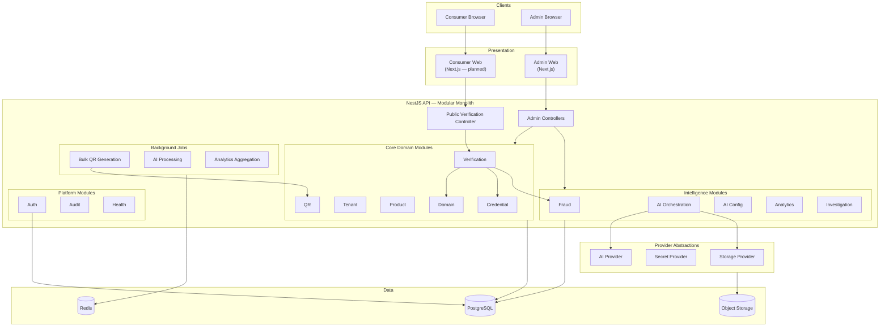
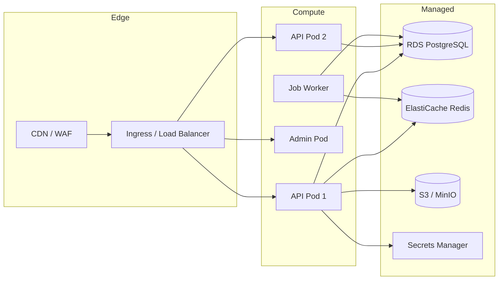

# TrueMark System Architecture

> High-level system architecture for the TrueMark modular monolith.  
> **See also:** [Documentation index](../README.md) · [Infrastructure](../infrastructure/INFRASTRUCTURE.md) · [Deployment](../deployment/DEPLOYMENT_OVERVIEW.md)

## Overview

TrueMark is an enterprise product authentication platform deployed as a **modular monolith** with clear internal boundaries. A single NestJS API serves both public consumer verification endpoints and authenticated admin endpoints. A Next.js admin portal provides tenant management, product configuration, QR generation, fraud investigation, and analytics.

The platform supports four deployment models: **SaaS**, **dedicated cloud**, **on-premises**, and **hybrid**.

---

## Logical Architecture



---

## Deployment Architecture



---

## Monorepo Layout

| Package / App     | Purpose                                     |
| ----------------- | ------------------------------------------- |
| `apps/api`        | NestJS modular monolith — all backend logic |
| `apps/admin-web`  | Next.js admin portal                        |
| `packages/db`     | Prisma schema, migrations, seed             |
| `packages/shared` | Shared enums, Zod schemas, constants        |
| `packages/config` | Environment validation (Zod)                |

---

## API Module Map

| Module             | Responsibility                                 | Auth                       |
| ------------------ | ---------------------------------------------- | -------------------------- |
| `auth`             | Login, JWT, OIDC strategy                      | Public (login) / Protected |
| `tenant`           | Tenant CRUD, profile                           | Admin                      |
| `domain`           | Company + verification domains, DNS challenges | Admin                      |
| `product`          | Manufacturer → Unit hierarchy                  | Admin                      |
| `credential`       | Token generation, hashing, normalization       | Internal                   |
| `qr`               | QR generation, lifecycle, export               | Admin                      |
| `qr-customization` | Visual QR config                               | Admin                      |
| `verification`     | Core verification (public)                     | **Public**                 |
| `fraud`            | Signal evaluation, risk scoring                | Internal + Admin read      |
| `ai-config`        | AI mode, quotas, reference data                | Admin                      |
| `ai-orchestration` | Image upload, AI job processing                | Public (post-verify)       |
| `analytics`        | Aggregated metrics                             | Admin                      |
| `investigation`    | Fraud investigation workflow                   | Admin                      |
| `consumer-report`  | Suspicious product reports                     | **Public**                 |
| `audit`            | Immutable audit trail                          | Internal                   |
| `health`           | Liveness/readiness probes                      | Public                     |

---

## Request Flows

### Admin Request

```
Admin Browser → Admin Web → API (JWT validated)
  → RolesGuard (role check)
  → TenantGuard (tenant from JWT)
  → Controller → Service → Prisma (tenant-scoped query)
  → AuditService.log()
```

### Consumer Verification Request

```
Consumer Browser → Consumer Web → API (no auth)
  → ThrottlerGuard (rate limit)
  → PublicVerificationController
  → CoreVerificationService
    → DomainService (hostname → tenant)
    → CredentialService (token verify)
    → SignalEvaluatorService (fraud signals)
  → VerificationEvent persisted
  → Response (no internal IDs)
```

---

## Provider Abstraction Pattern

All infrastructure dependencies are accessed through interfaces defined in `apps/api/src/providers/interfaces.ts`:

```typescript
// Conceptual — see providers/interfaces.ts for actual definitions
interface StorageProvider {
  upload(key: string, data: Buffer): Promise<string>;
  download(key: string): Promise<Buffer>;
  delete(key: string): Promise<void>;
}

interface SecretProvider {
  get(key: string): Promise<string>;
}

interface AiProvider {
  analyzeImages(input: AiAnalyzeInput): Promise<AiAnalyzeResult>;
}
```

Implementations are selected via environment configuration:

| Provider | Dev     | Cloud               | On-Prem            |
| -------- | ------- | ------------------- | ------------------ |
| Storage  | `local` | `s3`                | `minio`            |
| Secrets  | `env`   | AWS Secrets Manager | Vault              |
| AI       | `mock`  | OpenAI / Azure      | Local model / mock |

---

## Data Architecture

PostgreSQL is the **single source of truth** for all relational data:

- Tenant configuration and domains
- Product hierarchy (manufacturer → unit)
- QR codes and credentials
- Verification events (append-only)
- Fraud signals, investigations
- AI jobs and results
- Audit logs
- Analytics aggregates

Redis serves:

- Rate limiting counters
- BullMQ job queues (bulk QR, AI processing, analytics)
- Optional domain resolution cache (future)

Object storage holds:

- AI reference images
- Consumer-uploaded verification images
- QR export files (PDF/ZIP)
- QR customization assets (logos)

---

## Security Architecture

| Layer              | Mechanism                                       |
| ------------------ | ----------------------------------------------- |
| Transport          | TLS 1.2+ everywhere                             |
| Admin auth         | JWT (dev) / OIDC + MFA (prod)                   |
| Authorization      | RBAC via `@Roles()` + `RolesGuard`              |
| Tenant isolation   | `TenantGuard` + mandatory `tenantId` in queries |
| Consumer auth      | None (by design)                                |
| Rate limiting      | `@nestjs/throttler` on public endpoints         |
| Input validation   | class-validator DTOs + Zod env schema           |
| Credential storage | Argon2 hash, prefix index                       |
| Audit              | Append-only `audit_logs` table                  |
| Secrets            | Provider abstraction, never in source           |

See [Threat Model](../THREAT_MODEL.md) for full analysis.

---

## Observability

| Signal      | Implementation                                     |
| ----------- | -------------------------------------------------- |
| Logging     | Structured JSON via `LoggingInterceptor`           |
| Correlation | `X-Correlation-Id` via `CorrelationInterceptor`    |
| Health      | `/health` (liveness), `/health/ready` (DB + Redis) |
| Metrics     | Planned: Prometheus `/metrics` endpoint            |
| Tracing     | Planned: OpenTelemetry integration                 |
| Alerting    | CloudWatch / Datadog (deployment-specific)         |

---

## Scalability

| Component      | Scaling Strategy                                 |
| -------------- | ------------------------------------------------ |
| API            | Horizontal (stateless pods behind load balancer) |
| Admin Web      | Horizontal (stateless Next.js)                   |
| PostgreSQL     | Vertical + read replicas for analytics           |
| Redis          | Cluster mode for HA                              |
| BullMQ workers | Horizontal worker pods                           |
| Object storage | Provider-native scaling (S3/MinIO)               |

Core verification is designed to be **fast and synchronous** — no queue on the hot path. AI and bulk operations are async via BullMQ.

---

## Deployment Models

| Model           | Description                                     | Reference                                           |
| --------------- | ----------------------------------------------- | --------------------------------------------------- |
| SaaS            | Multi-tenant, TrueMark-operated cloud           | [Cloud Deploy Runbook](../runbooks/cloud-deploy.md) |
| Dedicated Cloud | Single-tenant in customer AWS/Azure/GCP account | Terraform + Helm                                    |
| On-Prem         | Full stack in customer datacenter               | [On-Prem Runbook](../runbooks/onprem-install.md)    |
| Hybrid          | Split components across boundaries              | [Hybrid Architecture](./HYBRID.md)                  |

---

## Technology Decisions

See the **Technology Decisions** table above and [Infrastructure Overview](../infrastructure/INFRASTRUCTURE.md) for deployment choices.

**Key principle:** Do not introduce microservices, Kubernetes, or queues unless the phase requirements demand it. The modular monolith provides clear boundaries with operational simplicity.

---

## Related Documents

- [Tenant & Domain Model](./TENANT_DOMAIN.md)
- [Core Verification Flow](./CORE_VERIFICATION.md)
- [AI Boundary](./AI.md)
- [Hybrid Deployment](./HYBRID.md)
- [Threat Model](../THREAT_MODEL.md)
- [Code Review](../CODE_REVIEW.md)
