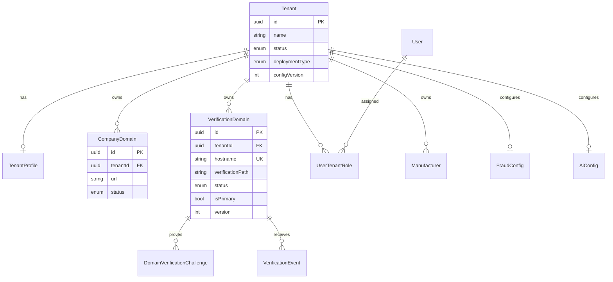
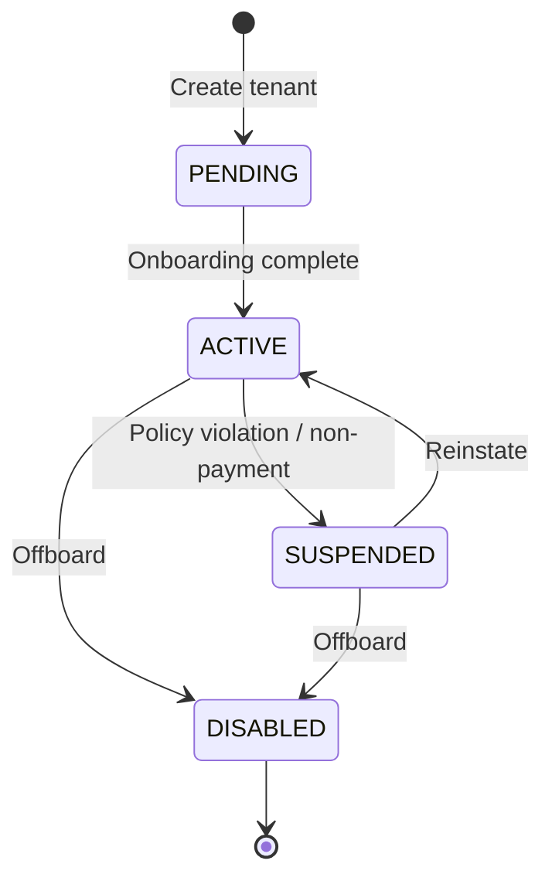
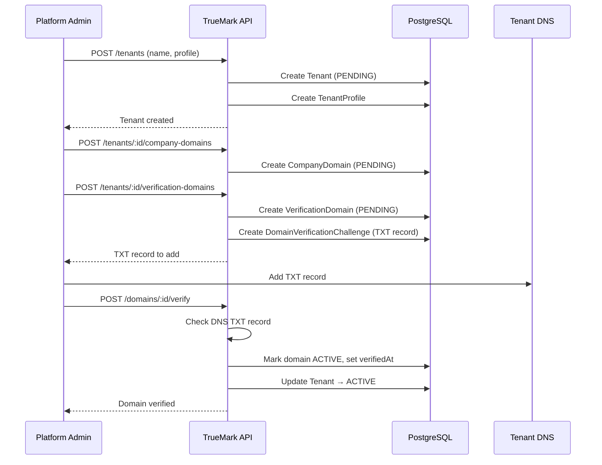
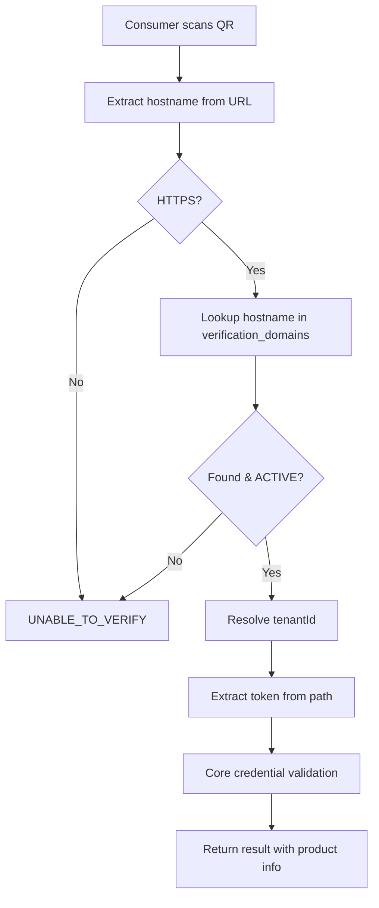

# Tenant & Domain Model

> Architecture for multi-tenant isolation, company domains, and TrueMark verification domains.

## Concepts

| Concept | Description |
|---------|-------------|
| **Tenant** | A customer company using TrueMark (manufacturer, brand owner, distributor) |
| **Company Domain** | The tenant's official corporate website (e.g., `https://www.abcpharma.com`) |
| **Verification Domain** | The tenant-specific TrueMark verification hostname (e.g., `verify.abcpharma.com`) |
| **Deployment Type** | How the tenant's environment is hosted (SAAS, DEDICATED_CLOUD, CUSTOMER_CLOUD, ON_PREM, HYBRID) |

Each tenant is **logically isolated**. No tenant can access another tenant's data. Tenant-specific configuration is stored in the authoritative database — never hardcoded in environment variables.

---

## Entity Relationship



---

## Tenant Lifecycle



| Status | Meaning |
|--------|---------|
| `PENDING` | Created but onboarding incomplete (domains not verified) |
| `ACTIVE` | Fully operational |
| `SUSPENDED` | Temporarily disabled; verifications may return SUSPENDED |
| `DISABLED` | Permanently offboarded; data retained per retention policy |

---

## Tenant Onboarding Flow



---

## Domain Types

### Company Domain

Identifies the tenant's official corporate presence. Used for:

- Admin UI branding references
- Consumer trust display ("Registered to ABC Pharmaceuticals")
- Validation that verification domain belongs to same organization

**Constraints:**
- Must be valid HTTPS URL
- Unique per tenant (same URL cannot be registered to two tenants)
- Status lifecycle: PENDING → ACTIVE → SUSPENDED/REVOKED/DISABLED

### Verification Domain

The hostname consumers visit when scanning a QR code. This is the **critical security anchor** for tenant resolution during verification.

**Example QR URL:**
```
https://verify.abcpharma.com/v/AbCdEf1234567890...
```

**Constraints:**
- `hostname` is globally unique across all tenants
- Only `ACTIVE` domains resolve during verification
- `verificationPath` defaults to `/v` (configurable per domain)
- `version` increments on any configuration change (stored on verification events)
- `isPrimary` designates the canonical domain for QR generation

---

## Domain Verification (DNS TXT)

Before a verification domain becomes ACTIVE, ownership must be proven via DNS TXT challenge:

1. Admin registers `verify.abcpharma.com` for tenant
2. System generates TXT record: `_truemark-verify.verify.abcpharma.com TXT "truemark-challenge=<random-token>"`
3. Admin adds TXT record to DNS
4. System polls DNS and validates token
5. On success: domain status → ACTIVE, challenge `verifiedAt` set

**Security controls:**
- Challenge expires after configurable period (default 72h)
- No HTTP callback to user-supplied URLs (SSRF prevention)
- Hostname validated: no IP literals, no localhost, no internal TLDs
- Only one active challenge per domain at a time

---

## Tenant Resolution During Verification

When a consumer scans a QR code, tenant resolution follows this sequence:



**Critical rule:** Domain validation establishes that the request belongs to an approved TrueMark tenant. It does **not** prove product authenticity — that requires credential validation.

Implementation: `DomainService.resolveTenantByHostname()` in `apps/api/src/modules/domain/domain.service.ts`.

---

## Tenant Isolation

### Server-Side Enforcement

```typescript
// NEVER trust tenantId from request body
@UseGuards(JwtAuthGuard, TenantGuard, RolesGuard)
@Get('products')
async listProducts(@CurrentUser() user: AuthUser) {
  // TenantGuard sets user.tenantId from JWT claims
  return this.productService.findAll(user.tenantId);
}
```

### Rules

1. **Never** accept `tenantId`, `organizationId`, or `companyId` from browser/client input for authorization
2. Tenant context derived from authenticated JWT claims (admin) or hostname resolution (consumer)
3. Every database query on tenant-scoped tables includes `WHERE tenantId = :tenantId`
4. Platform admins (`PLATFORM_ADMIN` role) may access cross-tenant resources with explicit audit logging
5. Integration tests must verify cross-tenant access returns 403

### RBAC Roles

| Role | Scope | Capabilities |
|------|-------|-------------|
| `PLATFORM_ADMIN` | Global | All tenants, platform configuration |
| `TENANT_ADMIN` | Single tenant | Full tenant management |
| `MANUFACTURER_ADMIN` | Single tenant | Manufacturer/brand/product management |
| `PRODUCT_MANAGER` | Single tenant | Product CRUD, QR generation |
| `FRAUD_INVESTIGATOR` | Single tenant | Investigations, fraud intelligence |
| `ANALYST` | Single tenant | Read-only analytics |
| `READ_ONLY` | Single tenant | Read-only access |

---

## Multi-Tenant SaaS vs Dedicated Deployment

| Aspect | SaaS (shared) | Dedicated / On-Prem |
|--------|--------------|---------------------|
| Tenant count | Many | One (or few) |
| Domain hostnames | Unique globally | Unique globally |
| Database | Shared with row-level isolation | Dedicated instance |
| Configuration | `deploymentType: SAAS` | `DEDICATED_CLOUD` / `ON_PREM` |
| Admin access | Platform admin + tenant admin | Tenant admin only |

Even in dedicated/on-prem deployments, the tenant model is preserved — it enables future multi-division support and consistent code paths.

---

## Domain Security

### Threats Addressed

| Threat | Control |
|--------|---------|
| Domain spoofing | Exact hostname match; DNS TXT verification |
| Host header attack | Resolve from TLS SNI / ingress config |
| Open redirect | No user-controlled redirect URLs |
| Subdomain confusion | Explicit registration; no wildcard auto-accept |
| Unauthorized domain change | Admin role required; audit logged; version increment |

### Domain Change Protocol

1. Admin submits domain change request
2. New domain created in PENDING status
3. DNS TXT verification required
4. Old domain remains ACTIVE until new domain verified
5. Admin promotes new domain to primary
6. Old domain set to REVOKED after grace period
7. QR codes with old domain continue to work until credential revoked (domain version tracked on events)

---

## Configuration Versioning

Both tenant (`configVersion`) and verification domain (`version`) maintain version counters incremented on configuration changes. Verification events store `domainConfigVersion` to provide audit context — "this verification occurred under domain config v3."

---

## Database Schema Reference

Key tables (see `packages/db/prisma/schema.prisma`):

- `tenants` — core tenant record
- `tenant_profiles` — address, contact, metadata
- `company_domains` — official company URLs
- `verification_domains` — verification hostnames
- `domain_verification_challenges` — DNS TXT challenges
- `user_tenant_roles` — RBAC assignments

---

## API Endpoints (Phase 2)

All admin endpoints require JWT authentication. Tenant-scoped routes enforce `TenantGuard` — tenant admins may only access assigned tenants; platform admins may access any tenant.

| Method | Path | Auth | Description |
|--------|------|------|-------------|
| POST | `/admin/tenants` | Platform Admin | Create tenant |
| GET | `/admin/tenants` | Admin | List tenants (scoped by role) |
| GET | `/admin/tenants/:tenantId` | Admin | Get tenant details |
| PATCH | `/admin/tenants/:tenantId` | Tenant Admin | Update tenant (name, status, deployment type) |
| PATCH | `/admin/tenants/:tenantId/profile` | Tenant Admin | Update tenant profile |
| GET | `/admin/tenants/:tenantId/configuration` | Admin | Get tenant configuration snapshot |
| GET | `/admin/tenants/:tenantId/domains` | Admin | Full domain configuration |
| POST | `/admin/tenants/:tenantId/domains/company` | Tenant Admin | Add company domain |
| PATCH | `/admin/tenants/:tenantId/domains/company/:id/status` | Tenant Admin | Change company domain lifecycle |
| POST | `/admin/tenants/:tenantId/domains/company/:id/activate` | Tenant Admin | Activate company domain |
| POST | `/admin/tenants/:tenantId/domains/verification` | Tenant Admin | Register verification domain |
| GET | `/admin/tenants/:tenantId/domains/verification/:id/challenge` | Tenant Admin | Get DNS TXT challenge |
| POST | `/admin/tenants/:tenantId/domains/verification/:id/challenge/refresh` | Tenant Admin | Refresh expired challenge |
| POST | `/admin/tenants/:tenantId/domains/verification/:id/verify` | Tenant Admin | Trigger DNS verification |
| PATCH | `/admin/tenants/:tenantId/domains/verification/:id/status` | Tenant Admin | Change verification domain lifecycle |
| POST | `/admin/tenants/:tenantId/domains/verification/:id/primary` | Tenant Admin | Set primary verification domain |

### Domain validation rules

- Company domains must be valid HTTPS URLs; stored normalized (lowercase hostname, no trailing slash).
- Verification domains must be valid HTTPS hostnames; globally unique after normalization.
- Blocklisted hostnames (e.g. `example.com`, `localhost`, IP literals) are rejected unless explicitly allowed in development.
- Verification path defaults to `/v`; must be a safe path prefix (no `..`, no open redirects).
- Only `ACTIVE` verification domains are resolved during consumer verification (future phase).

### Audit events

Security-sensitive operations emit audit records including actor, tenant, action, resource, correlation ID, and metadata (never secrets):

- `TENANT_CREATED`, `TENANT_UPDATED`, `TENANT_STATUS_CHANGED`
- `COMPANY_DOMAIN_CREATED`, `COMPANY_DOMAIN_UPDATED`, `DOMAIN_STATUS_CHANGED`
- `VERIFICATION_DOMAIN_CREATED`, `VERIFICATION_DOMAIN_UPDATED`
- `TENANT_CONFIGURATION_CHANGED`

### Testing

Phase 2 security tests live in:

- `apps/api/src/modules/domain/domain-validation.util.spec.ts`
- `apps/api/src/modules/domain/domain.service.spec.ts`
- `apps/api/src/common/guards/tenant.guard.spec.ts`

Run: `pnpm --filter @truemark/api test`

---

## Related Documents

- [System Architecture](./SYSTEM.md)
- [Core Verification Flow](./CORE_VERIFICATION.md)
- [Threat Model](../THREAT_MODEL.md) — T-05, T-06, T-07, T-08
